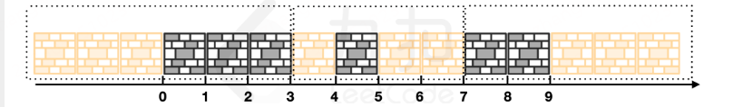

## 题目

在探险营地间，小扣意外发现了一片城墙遗迹，在探索期间，却不巧遇到迁徙中的兽群向他迎面冲来。情急之下小扣吹响了他的苍蓝笛，随着笛声响起，遗迹中的城墙逐渐发生了横向膨胀。  
已知 `rampart[i] = [x,y]` 表示第 `i` 段城墙的初始所在区间。当城墙发生膨胀时，将遵循以下规则：  
- 所有的城墙会同时膨胀相等的长度；  
- 每个城墙可以向左、向右或向两个方向膨胀。  

小扣为了确保自身的安全，需要在所有城墙均无重叠的情况下，让城墙尽可能的膨胀。请返回城墙可以膨胀的 **最大值** 。

**注意：**
- 初始情况下，所有城墙均不重叠，且 `rampart` 中的元素升序排列；
- 两侧的城墙可以向外无限膨胀。

**示例 1：**
>输入：`rampart = [[0,3],[4,5],[7,9]]`
>
>输出：`3`
>
>解释：如下图所示：
>`rampart[0]` 向左侧膨胀 3 个单位；  
>`rampart[2]` 向右侧膨胀 3 个单位；  
>`rampart[1]` 向左侧膨胀 1 个单位，向右膨胀 2 个单位。  
>不存在膨胀更多的方案，返回 3。  


**示例 2：**
>输入：`rampart = [[1,2],[5,8],[11,15],[18,25]]`
>
>输出：`4`

## 思路
1. 贪心，每段城墙先向左膨胀，再向右膨胀，如果超过右侧的城墙则说明答案过大。如果都可以膨胀，则继续二分更大的答案。
2. 二分上界为中间剩余空间的平均值。

```go 
func rampartDefensiveLine(rampart [][]int) (ans int) {
	n := len(rampart)
	leftSpace := rampart[n-1][0] - rampart[0][1]
	for _, p := range rampart[1 : n-1] {
		leftSpace -= p[1] - p[0]
	}
	return sort.Search(leftSpace/(n-2), func(mx int) bool {
		mx++
		preR := rampart[0][1]
		for i := 1; i < n-1; i++ {
			r := rampart[i][1]
			space := mx - (rampart[i][0] - preR)
			if space > 0 {
				r += space // 向右膨胀
				if r > rampart[i+1][0] { // 无法膨胀
					return true
				}
			}
			preR = r
		}
		return false
	})
}
```

### 复杂度分析

- 时间复杂度：{O}(n\log (U/n))，其中 n 为 {rampart} 的长度，U 为城墙范围。
- 空间复杂度：{O}(1)。仅用到若干额外变量。